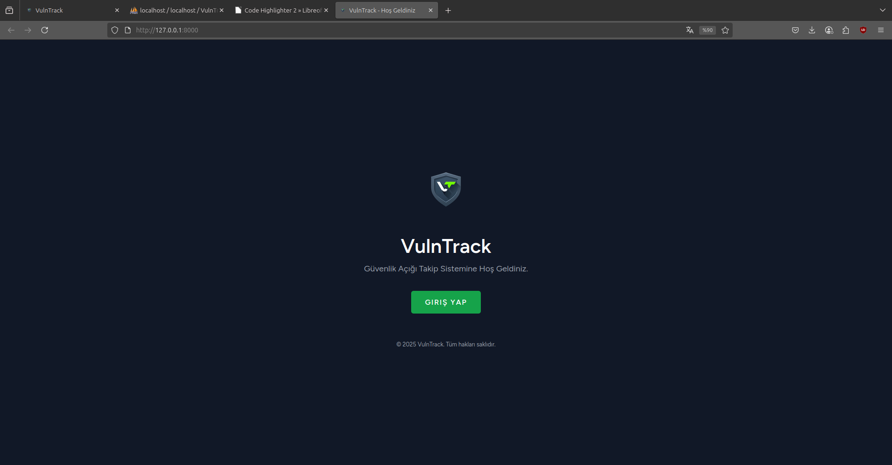
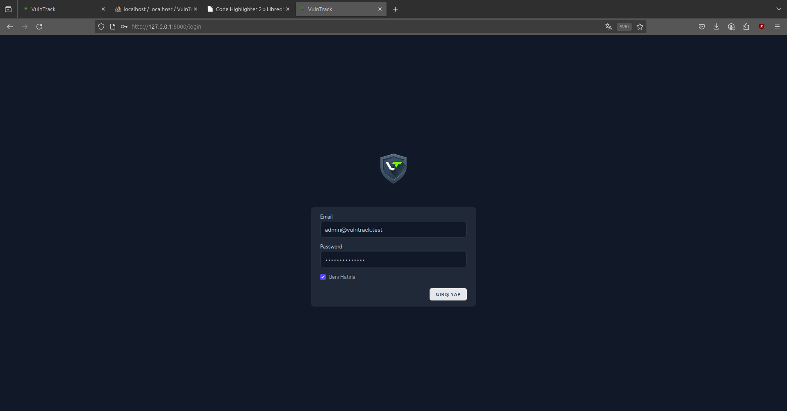
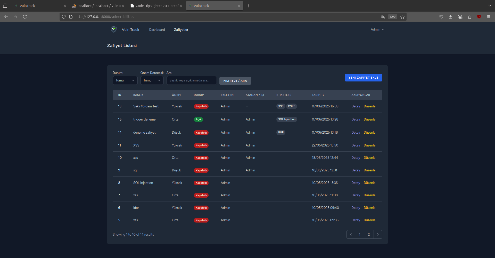
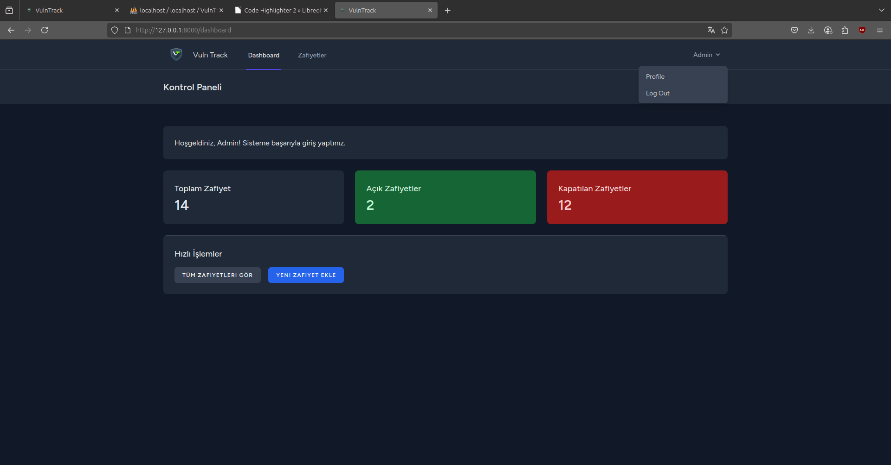
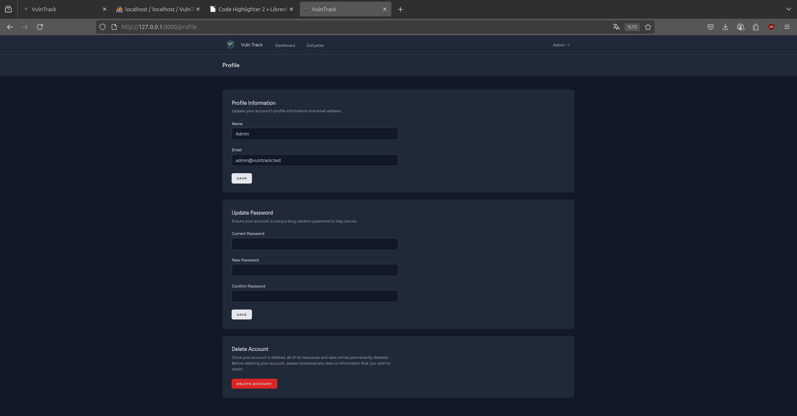
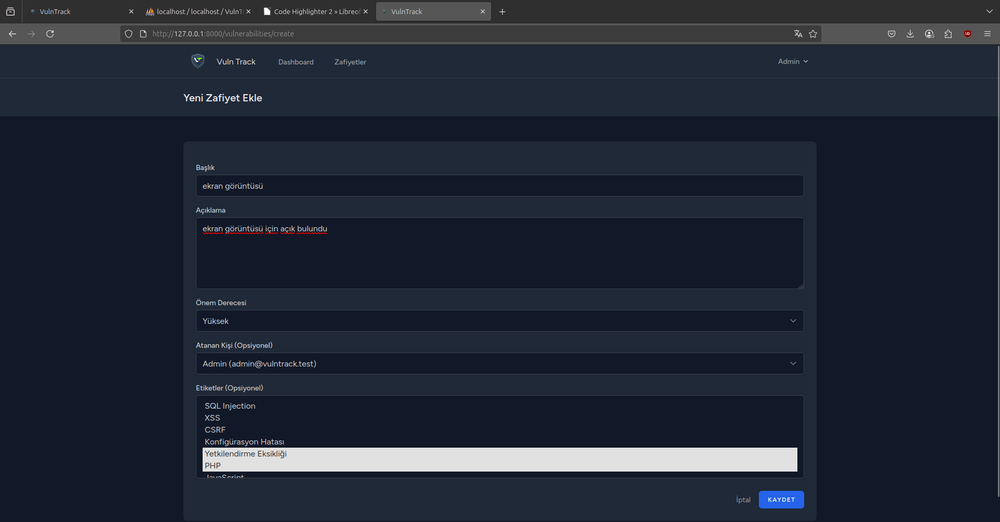
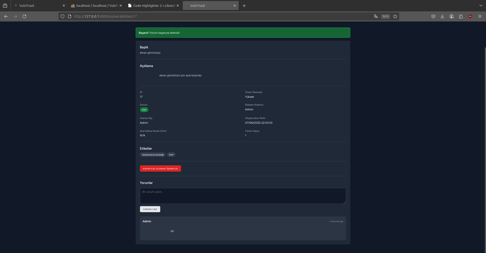
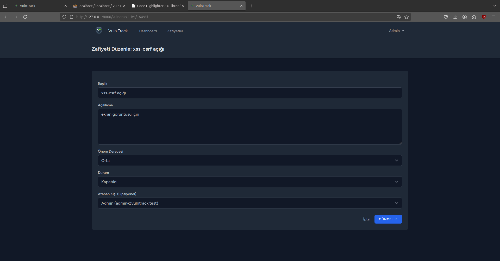
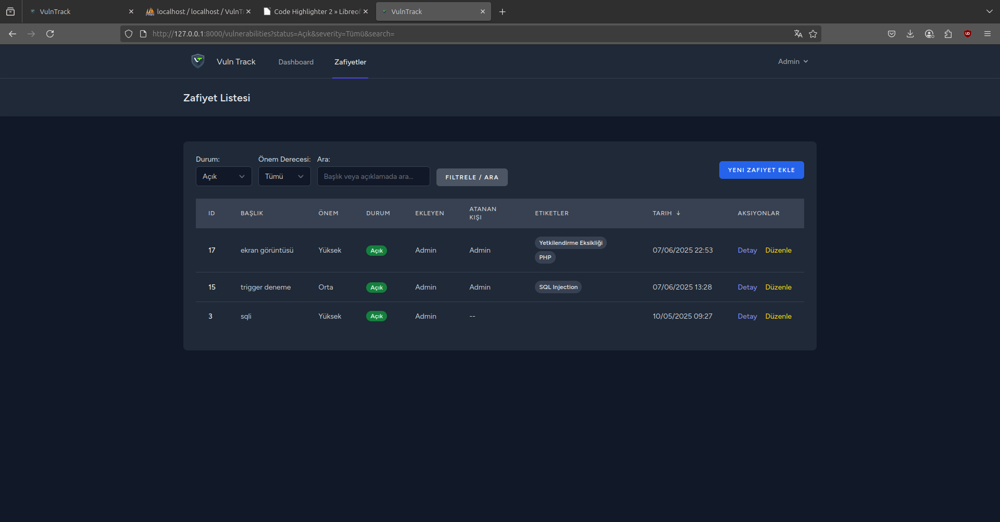
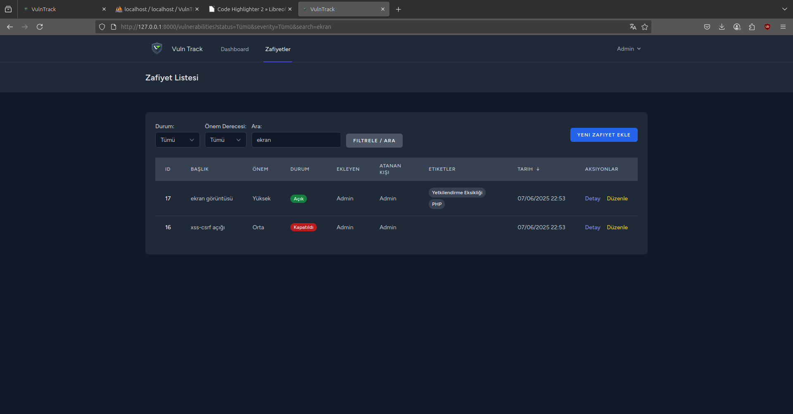

# VulnTrack - Güvenlik Açığı Takip Sistemi


<p align="center">
  <em>Güvenlik açıklarının keşfinden kapatılmasına kadar tüm yaşam döngüsünü yönetin.</em>
</p>

VulnTrack, yazılım geliştirme ekipleri veya siber güvenlik birimleri için tasarlanmış bir **Güvenlik Açığı Takip Sistemi Simülatörüdür**. Projenin temel amacı, bir yazılım ürünündeki veya sistemdeki güvenlik açıklarının (zafiyetlerin) keşfedildiği andan kapatıldığı ana kadar olan tüm yaşam döngüsünü düzenli bir şekilde yönetmektir.

## 📋 İçindekiler

- [Öne Çıkan Özellikler](#öne-çıkan-özellikler)
- [Kullanılan Teknolojiler](#kullanılan-teknolojiler)
- [Kurulum Adımları](#kurulum-adımları)
- [Kullanım](#kullanım)
- [Ekran Görüntüleri](#ekran-görüntüleri)


##  Öne Çıkan Özellikler

-   **Detaylı Zafiyet Kaydı:** Güvenlik açıklarını tüm detaylarıyla (açıklama, etki, çözüm önerisi vb.) kaydedin ve yönetin.
-   **Durum ve Öncelik Takibi:** Her zafiyetin önem derecesini (Kritik, Yüksek, Orta, Düşük) ve durumunu (Yeni, İnceleniyor, Kapatıldı) takip edin.
-   **Görev Atama (Assign):** Zafiyetlerin çözümü için belirli kullanıcılara atama yapın ve ilerlemeyi izleyin.
-   **Etiketleme (Tags):** Zafiyetleri türlerine (örn: `XSS`, `SQL Injection`) veya etkilendikleri teknolojilere (örn: `PHP`, `Apache`) göre etiketleyerek sınıflandırın.
-   **İş Birliği için Yorumlar:** Her bir zafiyet kaydı altında ekip üyelerinin yorumlar ekleyerek iletişim kurmasını sağlayın.
-   **Aktivite Kaydı (Activity Log):** Bir zafiyet üzerinde yapılan tüm önemli değişiklikleri (oluşturulma, durum değişikliği, yorum ekleme vb.) geçmişe dönük olarak izleyin.

##  Kullanılan Teknolojiler

-   **Backend:** PHP 8.x, Laravel 10.x
-   **Veritabanı:** MySQL
-   **Frontend:** TailwindCSS, JavaScript
-   **Paket Yöneticisi:** Composer

##  Kurulum Adımları

Projeyi yerel makinenizde çalıştırmak için aşağıdaki adımları izleyin.

### Gereksinimler

-   PHP >= 8.1
-   Composer
-   MySQL Veritabanı
-   Node.js ve NPM (Opsiyonel, frontend bağımlılıkları için)

### Adım Adım Kurulum

1.  **Projeyi klonlayın:**
    ```bash
    git clone (https://github.com/memreok/VulnTrack.git)
    cd VulnTrack
    ```

2.  **Ortam dosyasını oluşturun:**
    `.env.example` dosyasını kopyalayarak `.env` adında yeni bir dosya oluşturun.
    ```bash
    cp .env.example .env
    ```

3.  **PHP bağımlılıklarını yükleyin:**
    ```bash
    composer install
    ```

4.  **Uygulama anahtarını (APP_KEY) oluşturun:**
    ```bash
    php artisan key:generate
    ```

5.  **`.env` dosyasını yapılandırın:**
    Oluşturduğunuz `.env` dosyasını açın ve veritabanı bağlantı bilgilerinizi (`DB_DATABASE`, `DB_USERNAME`, `DB_PASSWORD`) girin.
    ```env
    DB_CONNECTION=mysql
    DB_HOST=127.0.0.1
    DB_PORT=3306
    DB_DATABASE=vulntrack
    DB_USERNAME=root
    DB_PASSWORD=
    ```

6.  **Veritabanını oluşturun ve başlangıç verilerini yükleyin:**
    Bu komut, veritabanı tablolarını oluşturur ve (varsa) başlangıç verilerini ekler.
    ```bash
    php artisan migrate --seed
    ```

7.  **Uygulamayı çalıştırın:**
    ```bash
    php artisan serve
    ```

8.  Uygulamaya `http://127.0.0.1:8000` adresinden erişebilirsiniz.

##  Kullanım

Uygulamayı başlattıktan sonra, yeni kullanıcılar oluşturabilir, güvenlik açıkları ekleyebilir ve bunları yönetmeye başlayabilirsiniz.


## Ekran Görüntüleri






















---
Made with  by [memreok](https://github.com/memreok)
